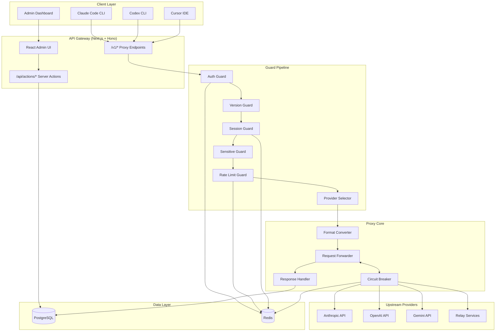

# System Architecture: claude-code-hub

**Date:** 2025-11-29
**Architect:** ding
**Version:** 1.0
**Project Type:** web-app
**Project Level:** 4
**Status:** Draft

---

## Document Overview

This document defines the system architecture for Claude Code Hub. It provides the technical blueprint for implementation, addressing all functional and non-functional requirements from the PRD.

**Related Documents:**

- Product Requirements Document: `docs/prd-claude-code-hub-2025-11-29.md`
- Product Brief: `docs/product-brief-claude-code-hub-2025-11-29.md`

---

## Executive Summary

Claude Code Hub (CCH) is an intelligent AI API proxy platform built on a **Modular Monolith** architecture using Next.js 15 with App Router and Hono. The system provides multi-provider management, intelligent load balancing, circuit breaker patterns, and comprehensive monitoring for AI coding tools like Claude Code and Codex.

The architecture emphasizes:

- **High Availability** through multi-provider failover and circuit breakers
- **Low Latency** through optimized proxy pipeline and Redis caching
- **Observability** through comprehensive request logging and real-time dashboards
- **Extensibility** through format converters and pluggable provider types

---

## Architectural Drivers

These requirements heavily influence architectural decisions:

### Critical Drivers (Must Address)

| NFR     | Requirement                   | Architectural Impact                                                        |
| ------- | ----------------------------- | --------------------------------------------------------------------------- |
| NFR-001 | Proxy latency < 50ms overhead | Requires in-memory caching, connection pooling, streaming optimization      |
| NFR-002 | 100+ concurrent sessions      | Requires stateless design, Redis for session state, connection limits       |
| NFR-003 | Reliable streaming            | Requires proper backpressure handling, chunked transfer, timeout management |
| NFR-007 | High availability             | Requires multi-provider failover, circuit breaker, Redis fail-open strategy |

### Important Drivers (Should Address)

| NFR     | Requirement            | Architectural Impact                                     |
| ------- | ---------------------- | -------------------------------------------------------- |
| NFR-004 | Secure authentication  | API key hashing, constant-time comparison, rate limiting |
| NFR-005 | Data protection        | TLS everywhere, key encryption at rest, masked logging   |
| NFR-008 | Horizontal scalability | Stateless app design, shared Redis, connection pooling   |
| NFR-011 | Code quality           | TypeScript strict mode, Drizzle ORM for type safety      |

---

## System Overview

### High-Level Architecture

Claude Code Hub follows a **Modular Monolith** pattern with clear internal boundaries:

```
┌─────────────────────────────────────────────────────────────────────────────┐
│                              CLIENT LAYER                                    │
│  ┌─────────────┐  ┌─────────────┐  ┌─────────────┐  ┌─────────────┐        │
│  │ Claude Code │  │  Codex CLI  │  │ Cursor IDE  │  │  Admin UI   │        │
│  └──────┬──────┘  └──────┬──────┘  └──────┬──────┘  └──────┬──────┘        │
└─────────┼────────────────┼────────────────┼────────────────┼────────────────┘
          │                │                │                │
          ▼                ▼                ▼                ▼
┌─────────────────────────────────────────────────────────────────────────────┐
│                           API GATEWAY LAYER                                  │
│  ┌─────────────────────────────────────────────────────────────────────┐    │
│  │                    Next.js 15 + Hono Router                          │    │
│  │  ┌───────────┐  ┌───────────┐  ┌───────────┐  ┌───────────┐         │    │
│  │  │ /v1/      │  │ /api/     │  │ /settings │  │ /dashboard│         │    │
│  │  │ messages  │  │ actions   │  │ (UI)      │  │ (UI)      │         │    │
│  │  └─────┬─────┘  └─────┬─────┘  └─────┬─────┘  └─────┬─────┘         │    │
│  └────────┼──────────────┼──────────────┼──────────────┼───────────────┘    │
└───────────┼──────────────┼──────────────┼──────────────┼────────────────────┘
            │              │              │              │
            ▼              ▼              ▼              ▼
┌─────────────────────────────────────────────────────────────────────────────┐
│                         GUARD PIPELINE LAYER                                 │
│  ┌────────┐ ┌────────┐ ┌────────┐ ┌────────┐ ┌────────┐ ┌────────┐         │
│  │  Auth  │→│Version │→│ Probe  │→│Session │→│Sensitive│→│  Rate  │→...    │
│  │ Guard  │ │ Guard  │ │Handler │ │ Guard  │ │ Guard  │ │ Limit  │         │
│  └────────┘ └────────┘ └────────┘ └────────┘ └────────┘ └────────┘         │
└─────────────────────────────────────────────────────────────────────────────┘
            │
            ▼
┌─────────────────────────────────────────────────────────────────────────────┐
│                        PROXY CORE LAYER                                      │
│  ┌─────────────────┐  ┌─────────────────┐  ┌─────────────────┐              │
│  │ Provider        │  │ Format          │  │ Response        │              │
│  │ Selector        │  │ Converter       │  │ Handler         │              │
│  │ (weighted LB)   │  │ (Claude↔OpenAI) │  │ (streaming)     │              │
│  └────────┬────────┘  └────────┬────────┘  └────────┬────────┘              │
│           │                    │                    │                        │
│  ┌────────┴────────────────────┴────────────────────┴────────┐              │
│  │                    Circuit Breaker                         │              │
│  │  ┌─────────┐  ┌─────────┐  ┌─────────┐                    │              │
│  │  │ CLOSED  │←→│  OPEN   │←→│HALF-OPEN│                    │              │
│  │  └─────────┘  └─────────┘  └─────────┘                    │              │
│  └────────────────────────────────────────────────────────────┘              │
└─────────────────────────────────────────────────────────────────────────────┘
            │
            ▼
┌─────────────────────────────────────────────────────────────────────────────┐
│                       UPSTREAM PROVIDERS                                     │
│  ┌──────────┐  ┌──────────┐  ┌──────────┐  ┌──────────┐  ┌──────────┐      │
│  │ Anthropic│  │  OpenAI  │  │  Gemini  │  │  Relay   │  │  Custom  │      │
│  │ (claude) │  │ (codex)  │  │ (gemini) │  │(claude-  │  │(openai-  │      │
│  │          │  │          │  │          │  │  auth)   │  │compatible│      │
│  └──────────┘  └──────────┘  └──────────┘  └──────────┘  └──────────┘      │
└─────────────────────────────────────────────────────────────────────────────┘

┌─────────────────────────────────────────────────────────────────────────────┐
│                         DATA LAYER                                           │
│  ┌─────────────────────────┐      ┌─────────────────────────┐               │
│  │       PostgreSQL        │      │          Redis          │               │
│  │  ┌─────┐ ┌─────┐ ┌────┐│      │  ┌─────┐ ┌─────┐ ┌────┐│               │
│  │  │users│ │keys │ │prov││      │  │sess │ │rate │ │circ││               │
│  │  ├─────┤ ├─────┤ ├────┤│      │  │ions │ │limit│ │uit ││               │
│  │  │msgs │ │rules│ │conf││      │  └─────┘ └─────┘ └────┘│               │
│  │  └─────┘ └─────┘ └────┘│      └─────────────────────────┘               │
│  └─────────────────────────┘                                                 │
└─────────────────────────────────────────────────────────────────────────────┘
```

### Architecture Diagram



### Architectural Pattern

**Pattern:** Modular Monolith with Guard Pipeline

**Rationale:**

- **Simplicity**: Single deployment unit reduces operational complexity
- **Performance**: In-process communication minimizes latency (critical for proxy)
- **Coherence**: Next.js provides unified frontend/backend development experience
- **Scalability**: Stateless design with Redis allows horizontal scaling when needed
- **Guard Pipeline**: Clean separation of cross-cutting concerns (auth, rate limiting, session)

**Why Not Microservices:**

- Proxy latency requirement (< 50ms) makes network hops expensive
- Single team (open-source maintainers) doesn't need service autonomy
- Operational complexity of distributed systems not justified for this scale

---

## Technology Stack

### Frontend

**Choice:** Next.js 15 (App Router) + React 19 + Tailwind CSS + shadcn/ui

**Rationale:**

- **Next.js 15**: Latest stable with App Router, Server Components, and Server Actions
- **React 19**: Latest features for optimal performance
- **Tailwind CSS**: Utility-first CSS for rapid UI development
- **shadcn/ui**: High-quality, accessible component library

**Trade-offs:**

- ✓ Gain: Full-stack TypeScript, SSR, optimal DX
- ✗ Lose: Heavier than pure SPA for simple UIs

**Key Libraries:**

- `next-intl` - Internationalization (i18n)
- `zustand` - Client state management
- `recharts` - Dashboard charts
- `lucide-react` - Icon library

---

### Backend

**Choice:** Hono + Next.js API Routes + Server Actions

**Rationale:**

- **Hono**: Ultra-fast, lightweight routing (critical for proxy performance)
- **Next.js API Routes**: Seamless integration with frontend
- **Server Actions**: Type-safe RPC for admin operations

**Trade-offs:**

- ✓ Gain: Sub-millisecond routing, TypeScript end-to-end
- ✗ Lose: Less conventional than Express/Fastify

**Key Libraries:**

- `undici` - HTTP client for upstream requests (faster than node-fetch)
- `zod` - Runtime schema validation
- `next-safe-action` - Type-safe Server Actions with OpenAPI generation

---

### Database

**Choice:** PostgreSQL + Drizzle ORM

**Rationale:**

- **PostgreSQL**: Robust ACID compliance, JSON support, excellent indexing
- **Drizzle ORM**: Type-safe, SQL-first ORM with minimal overhead

**Trade-offs:**

- ✓ Gain: Full SQL power, type safety, relational integrity
- ✗ Lose: Requires PostgreSQL infrastructure (not serverless-native)

**Key Features:**

- Connection pooling via `pg` driver
- Soft delete pattern (deletedAt column)
- JSON columns for flexible data (modelRedirects, providerChain)
- Comprehensive indexing strategy

---

### Caching & Session

**Choice:** Redis (ioredis)

**Rationale:**

- **Session Stickiness**: 5-minute TTL session-to-provider mapping
- **Rate Limiting**: Atomic Lua scripts for distributed rate limiting
- **Circuit Breaker State**: Shared circuit state across instances

**Trade-offs:**

- ✓ Gain: Fast, distributed state, atomic operations
- ✗ Lose: Additional infrastructure dependency

**Fail-Open Strategy:**

- Rate limiting fails open (allow requests) when Redis unavailable
- Session creation falls back to new selection
- Circuit breaker uses in-memory fallback

---

### Infrastructure

**Choice:** Docker + Docker Compose (Self-hosted)

**Rationale:**

- **Self-Deployment Focus**: Users deploy on their own infrastructure
- **Simplicity**: Single docker-compose.yaml for complete stack
- **Portability**: Runs on any Docker-compatible host

**Stack:**

```yaml
services:
  app: # Next.js application
  postgres: # PostgreSQL database
  redis: # Redis cache
```

**Future Consideration:** Kubernetes Helm charts for enterprise deployments

---

### Third-Party Services

| Service        | Purpose              | Integration         |
| -------------- | -------------------- | ------------------- |
| Anthropic API  | Primary AI provider  | Claude Messages API |
| OpenAI API     | Codex provider       | Responses API       |
| Google Gemini  | Alternative provider | Gemini API          |
| LiteLLM        | Pricing data sync    | Periodic fetch      |
| Various Relays | Alternative access   | Claude-auth format  |

---

### Development & Deployment

**Version Control:** Git + GitHub

**Package Manager:** Bun (faster than npm/yarn)

**Build Tool:** Turbopack (Next.js built-in)

**CI/CD:** GitHub Actions

- Lint + Type check on PR
- Build verification
- Docker image publishing

**Code Quality:**

- ESLint + Prettier
- TypeScript strict mode
- Husky pre-commit hooks

---

## System Components

### Component: Guard Pipeline

**Purpose:** Ordered chain of request processors for cross-cutting concerns

**Responsibilities:**

- Request authentication
- Client version validation
- Session management
- Content filtering
- Rate limiting
- Provider selection

**Interfaces:**

```typescript
interface GuardStep {
  name: string;
  execute(session: ProxySession): Promise<Response | null>;
}

interface GuardPipeline {
  run(session: ProxySession): Promise<Response | null>;
}
```

**Dependencies:**

- Redis (session, rate limiting)
- PostgreSQL (user/key lookup)

**FRs Addressed:** FR-010, FR-011, FR-012, FR-021, FR-023

**Pipeline Configuration:**

```typescript
// Full pipeline for chat requests
const CHAT_PIPELINE = [
  "auth", // API key validation
  "version", // Client version check
  "probe", // Probe request handling
  "session", // Session stickiness
  "sensitive", // Content filtering
  "rateLimit", // Rate limiting
  "provider", // Provider selection
  "messageContext", // Request logging
];

// Minimal pipeline for count_tokens
const COUNT_TOKENS_PIPELINE = ["auth", "version", "probe", "provider"];
```

---

### Component: Provider Selector

**Purpose:** Intelligently select optimal upstream provider for each request

**Responsibilities:**

- Weighted random selection
- Priority-based failover
- Circuit breaker integration
- Session stickiness
- Group tag filtering

**Algorithm:**

```
1. Filter enabled providers
2. Filter by circuit breaker state (exclude OPEN)
3. Filter by effective provider group (key.providerGroup overrides user.providerGroup; key.providerGroup is admin-only; user.providerGroup is derived from Key groups on Key changes)
4. Check session cache for sticky provider
5. If no sticky: weighted random selection by weight
6. Return selected provider or null (all unavailable)
```

**Interfaces:**

```typescript
interface ProviderSelection {
  provider: Provider;
  isSticky: boolean;
}

class ProxyProviderResolver {
  static ensure(session: ProxySession): Promise<Response | null>;
}
```

**Dependencies:**

- Redis (session cache, circuit state)
- PostgreSQL (provider list)

**FRs Addressed:** FR-003, FR-005, FR-007

---

### Component: Format Converter

**Purpose:** Bidirectional conversion between different AI API formats

**Responsibilities:**

- Request format transformation
- Response format transformation
- Streaming format adaptation
- Token count mapping

**Supported Conversions:**

| From            | To             | Direction     |
| --------------- | -------------- | ------------- |
| Claude Messages | OpenAI Chat    | Bidirectional |
| Claude Messages | Codex Response | Bidirectional |
| Claude Messages | Gemini         | Bidirectional |

**Interfaces:**

```typescript
interface FormatConverter {
  convertRequest(request: any, targetFormat: string): any;
  convertResponse(response: any, sourceFormat: string): any;
  convertStreamChunk(chunk: any, sourceFormat: string): any;
}
```

**FRs Addressed:** FR-006, FR-026, FR-027, FR-028

---

### Component: Circuit Breaker

**Purpose:** Prevent cascade failures by isolating failing providers

**Responsibilities:**

- Track provider failure rates
- Transition between states (CLOSED → OPEN → HALF-OPEN → CLOSED)
- Per-provider configuration
- Distributed state via Redis

**State Machine:**

```
                    failure threshold reached
        ┌───────────────────────────────────────┐
        │                                       ▼
    ┌───────┐                             ┌─────────┐
    │CLOSED │                             │  OPEN   │
    └───┬───┘                             └────┬────┘
        │                                      │
        │ success                              │ timeout expires
        │                                      ▼
        │                               ┌───────────┐
        └───────────────────────────────│ HALF-OPEN │
                  success threshold     └───────────┘
```

**Configuration (per provider):**

```typescript
{
  circuitBreakerFailureThreshold: 5,      // Failures before opening
  circuitBreakerOpenDuration: 1800000,    // 30 min open duration
  circuitBreakerHalfOpenSuccessThreshold: 2  // Successes to close
}
```

**FRs Addressed:** FR-004, FR-007

---

### Component: Response Handler

**Purpose:** Process and transform upstream responses for clients

**Responsibilities:**

- Streaming response forwarding
- Error classification
- Token counting
- Cost calculation
- Request logging

**Streaming Architecture:**

```
Upstream Provider (SSE)
        │
        ▼
┌───────────────────┐
│ Response Handler  │
│  - Parse chunks   │
│  - Transform      │
│  - Count tokens   │
│  - Calculate cost │
└────────┬──────────┘
         │
         ▼
   Client (SSE)
```

**FRs Addressed:** FR-006, FR-013

---

### Component: Message Service

**Purpose:** Log and track all proxy requests

**Responsibilities:**

- Request metadata capture
- Token usage tracking
- Cost calculation
- Error logging
- Session context

**Captured Data:**

```typescript
interface MessageRequestLog {
  providerId: number;
  userId: number;
  key: string;
  model: string;
  sessionId: string;
  durationMs: number;
  costUsd: number;
  inputTokens: number;
  outputTokens: number;
  statusCode: number;
  errorMessage?: string;
  providerChain: { id: number; name: string }[];
}
```

**FRs Addressed:** FR-013, FR-015, FR-016

---

### Component: Server Actions (Admin API)

**Purpose:** Type-safe RPC for admin operations

**Modules:**

- `providers.ts` - Provider CRUD, testing, stats
- `users.ts` - User management
- `keys.ts` - API key management
- `error-rules.ts` - Error rule configuration
- `sensitive-words.ts` - Content filter rules
- `statistics.ts` - Usage analytics
- `model-prices.ts` - Pricing management

**Features:**

- Automatic OpenAPI generation
- Type-safe input validation (Zod)
- Consistent error handling
- Authentication via admin token

**FRs Addressed:** FR-001, FR-008, FR-009, FR-019-FR-025

---

## Data Architecture

### Data Model

```
┌─────────────────┐     ┌─────────────────┐
│     users       │     │    providers    │
├─────────────────┤     ├─────────────────┤
│ id (PK)         │     │ id (PK)         │
│ name            │     │ name            │
│ role            │     │ url             │
│ rpmLimit        │     │ key (encrypted) │
│ dailyLimitUsd   │     │ weight          │
│ limit5hUsd      │     │ priority        │
│ limitWeeklyUsd  │     │ providerType    │
│ limitMonthlyUsd │     │ isEnabled       │
│ createdAt       │     │ circuitBreaker* │
│ deletedAt       │     │ limits*         │
└────────┬────────┘     │ timeouts*       │
         │              │ createdAt       │
         │              │ deletedAt       │
         │              └────────┬────────┘
         │                       │
         ▼                       ▼
┌─────────────────┐     ┌─────────────────┐
│      keys       │     │ message_request │
├─────────────────┤     ├─────────────────┤
│ id (PK)         │     │ id (PK)         │
│ userId (FK)     │────▶│ userId (FK)     │
│ key (unique)    │     │ providerId (FK) │◀────┘
│ name            │     │ key             │
│ isEnabled       │     │ model           │
│ expiresAt       │     │ sessionId       │
│ limits*         │     │ costUsd         │
│ createdAt       │     │ inputTokens     │
│ deletedAt       │     │ outputTokens    │
└─────────────────┘     │ durationMs      │
                        │ statusCode      │
                        │ providerChain   │
                        │ createdAt       │
                        └─────────────────┘

┌─────────────────┐     ┌─────────────────┐
│   error_rules   │     │ sensitive_words │
├─────────────────┤     ├─────────────────┤
│ id (PK)         │     │ id (PK)         │
│ pattern         │     │ word            │
│ matchType       │     │ matchType       │
│ category        │     │ isEnabled       │
│ isEnabled       │     │ createdAt       │
│ priority        │     └─────────────────┘
└─────────────────┘

┌─────────────────┐     ┌─────────────────────┐
│  model_prices   │     │ system_settings     │
├─────────────────┤     ├─────────────────────┤
│ id (PK)         │     │ id (PK)             │
│ modelName       │     │ siteTitle           │
│ priceData (JSON)│     │ currencyDisplay     │
│ createdAt       │     │ enableAutoCleanup   │
└─────────────────┘     │ cleanupRetention    │
                        └─────────────────────┘

┌───────────────────────┐
│ notification_settings │
├───────────────────────┤
│ id (PK)               │
│ enabled               │
│ circuitBreakerWebhook │
│ dailyLeaderboard*     │
│ costAlert*            │
└───────────────────────┘
```

### Database Design

**Indexing Strategy:**

| Table           | Index                                | Purpose                      |
| --------------- | ------------------------------------ | ---------------------------- |
| users           | `idx_users_active_role_sort`         | User list query optimization |
| keys            | `idx_keys_user_id`                   | Foreign key lookup           |
| providers       | `idx_providers_enabled_priority`     | Provider selection           |
| message_request | `idx_message_request_user_date_cost` | Statistics aggregation       |
| message_request | `idx_message_request_session_id`     | Session grouping             |
| error_rules     | `unique_pattern`                     | Pattern uniqueness           |

**Soft Delete Pattern:**

- All main tables have `deletedAt` column
- Queries filter `WHERE deleted_at IS NULL`
- Preserves referential integrity for historical data

**JSON Columns:**

- `providers.modelRedirects` - Model name mapping
- `providers.allowedModels` - Model whitelist
- `message_request.providerChain` - Request routing history
- `model_prices.priceData` - Flexible pricing structure

### Data Flow

**Request Flow:**

```
1. Client Request
   │
2. Auth Guard: Lookup key in PostgreSQL
   │
3. Session Guard: Check Redis for sticky session
   │
4. Rate Limit Guard: Check Redis counters (Lua script)
   │
5. Provider Selector: Query enabled providers from cache
   │
6. Forwarder: Send to upstream provider
   │
7. Response Handler: Stream response to client
   │
8. Message Service: Write to message_request table
```

**Session Data Flow:**

```
Redis Key: session:{session_id}
Value: { providerId: number, createdAt: timestamp }
TTL: 300 seconds (5 minutes)

Lookup: O(1) hash get
Creation: O(1) hash set with TTL
```

**Rate Limit Data Flow:**

```
Redis Keys:
- ratelimit:rpm:{userId}:{minute}
- ratelimit:5h:{userId}:{window}
- ratelimit:daily:{userId}:{day}
- ratelimit:weekly:{userId}:{week}
- ratelimit:monthly:{userId}:{month}

Operations: Lua scripts for atomic increment + check
```

---

## API Design

### API Architecture

**Pattern:** REST + Server Actions

**Versioning:** URL path versioning (`/v1/`)

**Authentication:**

- Proxy endpoints: API key in `Authorization: Bearer {key}` or `x-api-key: {key}`
- Admin endpoints: Admin token in cookie (HTTP-only)

**Response Format:** JSON (Claude API compatible for proxy endpoints)

### Proxy Endpoints

| Method | Endpoint                    | Description         | FR     |
| ------ | --------------------------- | ------------------- | ------ |
| POST   | `/v1/messages`              | Claude Messages API | FR-026 |
| POST   | `/v1/messages/count_tokens` | Token counting      | FR-026 |
| POST   | `/v1/chat/completions`      | OpenAI Chat API     | FR-027 |
| POST   | `/v1/responses`             | Codex Response API  | FR-028 |
| POST   | `/v1/generateContent`       | Gemini API          | FR-002 |

**Request Headers:**

```
Authorization: Bearer {api_key}
Content-Type: application/json
x-session-id: {optional_session_id}
x-client-version: {optional_version}
anthropic-version: 2023-06-01
```

**Response Headers:**

```
Content-Type: application/json  (or text/event-stream for streaming)
x-request-id: {request_id}
```

### Admin API (Server Actions)

**Providers:**

```
POST /api/actions - createProvider
GET  /api/actions - listProviders
GET  /api/actions - getProvider
PUT  /api/actions - updateProvider
DEL  /api/actions - deleteProvider
POST /api/actions - testProviderConnection
GET  /api/actions - getProviderStats
```

**Users:**

```
POST /api/actions - createUser
GET  /api/actions - listUsers
GET  /api/actions - getUser
PUT  /api/actions - updateUser
DEL  /api/actions - deleteUser
GET  /api/actions - getUserStats
```

**Keys:**

```
POST /api/actions - createKey
GET  /api/actions - listKeys
PUT  /api/actions - updateKey
DEL  /api/actions - revokeKey
```

**Statistics:**

```
GET /api/actions - getOverview
GET /api/actions - getUsageByUser
GET /api/actions - getUsageByProvider
GET /api/actions - getUsageByModel
GET /api/actions - getLeaderboard
```

### Authentication & Authorization

**API Key Authentication:**

```typescript
// Key format: cch_xxx...xxx (32+ characters)
// Storage: SHA-256 hash in database
// Lookup: O(1) indexed query

async function authenticateKey(key: string): Promise<AuthResult> {
  const hash = sha256(key);
  const keyRecord = await db.query.keys.findFirst({
    where: eq(keys.key, hash),
  });
  // Validate: exists, enabled, not expired
}
```

**Admin Token Authentication:**

```typescript
// Environment variable: ADMIN_TOKEN
// Stored in HTTP-only cookie after login
// Validated on each admin request
```

**Authorization Model:**

```
Roles:
- admin: Full access to admin UI and API
- user: Access to personal stats and settings

Permissions:
- API key gives user-level access
- Admin token gives admin access
```

---

## Non-Functional Requirements Coverage

### NFR-001: Proxy Latency

**Requirement:** Proxy overhead < 50ms for request processing

**Architecture Solution:**

- **Hono Router**: Sub-millisecond routing (vs 10ms+ for Express)
- **Connection Pooling**: Reuse upstream connections
- **Redis Caching**: In-memory session and rate limit checks
- **Streaming**: Zero-copy chunk forwarding
- **Minimal Middleware**: Guard pipeline optimized for speed

**Implementation Notes:**

```typescript
// Use undici for upstream requests (faster than node-fetch)
import { fetch } from "undici";

// Redis connection pooling
const redis = new Redis({ lazyConnect: true });

// Streaming response forwarding
return new Response(
  new ReadableStream({
    async start(controller) {
      for await (const chunk of upstreamResponse.body) {
        controller.enqueue(chunk);
      }
    },
  })
);
```

**Validation:**

- Measure request timing in message_request.duration_ms
- Monitor p95/p99 latency in production
- Target: < 50ms overhead, < 100ms p99

---

### NFR-002: Concurrent Capacity

**Requirement:** Support 100+ concurrent streaming sessions

**Architecture Solution:**

- **Stateless Design**: No in-memory session state
- **Redis Sessions**: Distributed session storage
- **Connection Limits**: Per-provider connection caps
- **Graceful Degradation**: Queue or reject excess connections

**Implementation Notes:**

```typescript
// Session stored in Redis with TTL
await redis.setex(
  `session:${sessionId}`,
  300,
  JSON.stringify({
    providerId,
    createdAt: Date.now(),
  })
);

// Provider concurrent session limit
if (activeSessions >= provider.limitConcurrentSessions) {
  return new Response("Too many concurrent sessions", { status: 429 });
}
```

**Validation:**

- Load test with 100+ concurrent WebSocket connections
- Monitor Redis memory usage
- Track active_sessions metric

---

### NFR-003: Streaming Reliability

**Requirement:** Reliable SSE streaming without message loss

**Architecture Solution:**

- **Chunked Transfer**: Stream chunks as received
- **Backpressure**: Respect client consumption rate
- **Timeout Handling**: Configurable idle timeouts
- **Error Recovery**: Clean connection termination

**Implementation Notes:**

```typescript
// Streaming with backpressure
const stream = new ReadableStream({
  async pull(controller) {
    const chunk = await reader.read();
    if (chunk.done) {
      controller.close();
    } else {
      controller.enqueue(chunk.value);
    }
  },
});

// Idle timeout (provider-configurable)
setTimeout(() => {
  if (!lastChunkTime || Date.now() - lastChunkTime > idleTimeout) {
    stream.cancel();
  }
}, idleTimeout);
```

**Validation:**

- End-to-end streaming tests
- Verify no chunk loss under load
- Test timeout behavior

---

### NFR-004: Authentication Security

**Requirement:** Secure API key handling

**Architecture Solution:**

- **Key Hashing**: SHA-256 hash stored, not plaintext
- **Constant-Time Comparison**: Prevent timing attacks
- **Rate Limiting**: Brute-force protection
- **Key Rotation**: Support for key revocation

**Implementation Notes:**

```typescript
// Key generation
function generateKey(): string {
  return `cch_${randomBytes(32).toString("hex")}`;
}

// Key hashing
function hashKey(key: string): string {
  return createHash("sha256").update(key).digest("hex");
}

// Constant-time comparison (via crypto.timingSafeEqual)
```

**Validation:**

- Security audit of key handling
- Penetration testing for auth bypass
- Verify no plaintext keys in logs

---

### NFR-007: High Availability

**Requirement:** Service continuity despite provider failures

**Architecture Solution:**

- **Circuit Breaker**: Isolate failing providers (per-provider)
- **Automatic Failover**: Retry on next available provider
- **Redis Fail-Open**: Allow requests when Redis unavailable
- **Health Checks**: Provider connectivity verification

**Implementation Notes:**

```typescript
// Circuit breaker states in Redis
const state = await redis.hget(`cb:${providerId}`, "state");
if (state === "OPEN") {
  // Skip this provider, try next
  return selectNextProvider();
}

// Fail-open for Redis
try {
  await checkRateLimit();
} catch (redisError) {
  console.warn("Redis unavailable, allowing request");
  // Continue without rate limiting
}
```

**Validation:**

- Chaos testing (kill providers)
- Redis failover testing
- Measure failover latency

---

## Security Architecture

### Authentication

**API Key Authentication:**

- Format: `cch_` prefix + 32 hex characters
- Storage: SHA-256 hash in PostgreSQL
- Transmission: HTTPS only, `Authorization: Bearer` header
- Lifetime: Configurable expiration, revocable

**Admin Authentication:**

- Single admin token (environment variable)
- HTTP-only cookie after login
- Session-based (not stateless)

### Authorization

**RBAC Model:**

```
Roles:
├── admin
│   ├── Manage providers
│   ├── Manage users
│   ├── Manage keys
│   ├── View all statistics
│   └── Configure system
└── user
    ├── Use proxy endpoints
    ├── View own statistics
    └── Manage own keys
```

**Permission Enforcement:**

```typescript
// Guard middleware pattern
const adminOnly = async (ctx, next) => {
  const token = ctx.cookies.get("adminToken");
  if (token !== process.env.ADMIN_TOKEN) {
    return ctx.json({ error: "Unauthorized" }, 401);
  }
  return next();
};
```

### Data Encryption

**In Transit:**

- TLS 1.3 for all connections
- HTTPS enforced via middleware
- Secure WebSocket (WSS) for real-time

**At Rest:**

- Provider API keys: Application-level encryption (recommended)
- Database: PostgreSQL encryption (optional, infrastructure)
- Backups: Encrypted (infrastructure responsibility)

### Security Best Practices

**Input Validation:**

```typescript
// Zod schemas for all inputs
const createProviderSchema = z.object({
  name: z.string().min(1).max(255),
  url: z.string().url(),
  key: z.string().min(10),
  // ...
});
```

**SQL Injection Prevention:**

- Drizzle ORM with parameterized queries
- No raw SQL with user input

**XSS Prevention:**

- React's automatic escaping
- Content-Security-Policy headers

**Rate Limiting:**

- Per-key rate limits
- Auth failure rate limiting
- DDoS protection (infrastructure)

**Logging Security:**

- API keys masked in logs
- Request bodies not logged by default
- Audit trail for admin actions

---

## Scalability & Performance

### Scaling Strategy

**Horizontal Scaling (Primary):**

```
                    Load Balancer
                          │
          ┌───────────────┼───────────────┐
          │               │               │
      ┌───┴───┐       ┌───┴───┐       ┌───┴───┐
      │ CCH-1 │       │ CCH-2 │       │ CCH-3 │
      └───┬───┘       └───┬───┘       └───┬───┘
          │               │               │
          └───────────────┼───────────────┘
                          │
              ┌───────────┴───────────┐
              │                       │
          ┌───┴───┐               ┌───┴───┐
          │ Redis │               │Postgres│
          │(Master)│              │(Primary)│
          └───┬───┘               └───┬───┘
              │                       │
          ┌───┴───┐               ┌───┴───┐
          │ Redis │               │Postgres│
          │(Replica)              │(Replica)│
          └───────┘               └───────┘
```

**Scaling Triggers:**

- CPU > 70% sustained
- Memory > 80%
- Request latency p99 > 200ms

### Performance Optimization

**Query Optimization:**

- Indexed queries for all hot paths
- Connection pooling (pgBouncer compatible)
- Prepared statements via Drizzle

**N+1 Prevention:**

- Eager loading for related entities
- Batch queries for statistics

**Memory Efficiency:**

- Streaming responses (no buffering)
- LRU cache for hot data (providers, rules)

### Caching Strategy

**Cache Layers:**

```
┌─────────────────────────────────────┐
│         CDN (Static Assets)         │  TTL: Long
├─────────────────────────────────────┤
│     Application Cache (In-Memory)   │  TTL: Short
│  - Provider list                    │
│  - Error rules                      │
│  - Sensitive words                  │
├─────────────────────────────────────┤
│            Redis Cache              │  TTL: Medium
│  - Session mappings                 │
│  - Rate limit counters              │
│  - Circuit breaker state            │
├─────────────────────────────────────┤
│         PostgreSQL                  │  Source of truth
└─────────────────────────────────────┘
```

**Cache Invalidation:**

- Provider changes: Invalidate provider cache
- Rule changes: Reload rules
- Session: TTL-based expiration

### Load Balancing

**Strategy:** Round-robin with health checks

**Health Check Endpoint:** `GET /api/health`

```json
{
  "status": "healthy",
  "checks": {
    "database": "ok",
    "redis": "ok"
  }
}
```

---

## Reliability & Availability

### High Availability Design

**No Single Points of Failure:**

- Multiple app instances behind load balancer
- Redis Sentinel or Cluster for failover
- PostgreSQL streaming replication

**Graceful Degradation:**

- Redis unavailable → Fail-open (allow requests)
- Single provider down → Automatic failover
- Database read issues → Serve from cache

### Disaster Recovery

**RPO (Recovery Point Objective):** 1 hour
**RTO (Recovery Time Objective):** 4 hours

**Backup Strategy:**

- PostgreSQL: pg_dump daily, WAL archiving
- Configuration: Git-versioned

**Recovery Procedure:**

1. Restore PostgreSQL from latest backup
2. Restore configuration from Git
3. Start application instances
4. Verify health checks
5. Resume traffic

### Backup Strategy

| Data       | Frequency  | Retention | Method             |
| ---------- | ---------- | --------- | ------------------ |
| PostgreSQL | Daily      | 30 days   | pg_dump + S3       |
| WAL logs   | Continuous | 7 days    | WAL archiving      |
| Config     | On change  | Unlimited | Git                |
| Redis      | N/A        | Ephemeral | Rebuilt on restart |

### Monitoring & Alerting

**Metrics (Prometheus format):**

```
# Request metrics
cch_requests_total{endpoint, status}
cch_request_duration_seconds{endpoint}

# Provider metrics
cch_provider_requests_total{provider, status}
cch_provider_circuit_state{provider}

# Resource metrics
cch_active_sessions
cch_redis_connections
cch_db_connections
```

**Alerting Thresholds:**
| Alert | Condition | Severity |
|-------|-----------|----------|
| High Error Rate | 5xx > 5% for 5min | Critical |
| High Latency | p99 > 500ms for 5min | Warning |
| Circuit Open | Any provider OPEN | Warning |
| Database Down | Health check fail | Critical |

---

## Integration Architecture

### External Integrations

**Upstream AI Providers:**

```typescript
interface ProviderAdapter {
  formatRequest(session: ProxySession): Request;
  parseResponse(response: Response): AsyncGenerator<Chunk>;
  handleError(error: Error): ErrorClassification;
}

// Implementations
class AnthropicAdapter implements ProviderAdapter {}
class OpenAIAdapter implements ProviderAdapter {}
class GeminiAdapter implements ProviderAdapter {}
```

**Webhook Integrations:**

- Enterprise WeChat robot notifications
- Circuit breaker alerts
- Daily usage reports

### Internal Integrations

**Module Communication:**

```
Actions Layer ←→ Repository Layer ←→ Database
     ↓
Guard Pipeline ←→ Redis ←→ Circuit Breaker
     ↓
Format Converters ←→ Provider Adapters
```

### Message/Event Architecture

**Current:** Synchronous request-response

**Future Consideration:** Event-driven for:

- Async cost calculation
- Background log processing
- Notification delivery

---

## Development Architecture

### Code Organization

```
src/
├── app/                    # Next.js App Router
│   ├── v1/                 # Proxy endpoints
│   │   └── _lib/           # Proxy core
│   │       ├── proxy/      # Guard pipeline, forwarder
│   │       ├── converters/ # Format converters
│   │       └── gemini/     # Gemini-specific
│   ├── api/                # REST API
│   │   └── actions/        # OpenAPI documentation
│   ├── dashboard/          # Admin UI pages
│   └── settings/           # Settings pages
├── actions/                # Server Actions
├── repository/             # Database queries
├── drizzle/                # Schema + migrations
├── lib/                    # Shared utilities
│   ├── rate-limit/         # Rate limiting
│   ├── circuit-breaker/    # Circuit breaker
│   └── session/            # Session management
├── types/                  # TypeScript types
└── components/             # React components
```

### Module Structure

**Bounded Contexts:**

- **Proxy**: Request handling, format conversion, provider selection
- **Admin**: User management, provider management, configuration
- **Analytics**: Statistics, logging, monitoring

**Dependency Rules:**

- Repository depends on Drizzle schema only
- Actions depend on Repository
- Guards depend on Repository and Redis
- UI depends on Actions

### Testing Strategy

**Unit Tests:**

- Format converters
- Rate limiting logic
- Circuit breaker state machine
- Validation schemas

**Integration Tests:**

- Guard pipeline
- Database queries
- Redis operations

**E2E Tests:**

- Full proxy flow
- Admin workflows
- Authentication flows

**Coverage Target:** 70%+

### CI/CD Pipeline

```yaml
name: CI/CD

on: [push, pull_request]

jobs:
  lint:
    - bun install
    - bun run lint
    - bun run typecheck

  test:
    - bun install
    - bun test

  build:
    - bun run build
    - docker build

  deploy:
    - docker push
    - deploy to staging/production
```

---

## Deployment Architecture

### Environments

| Environment | Purpose                | Database         | Redis            |
| ----------- | ---------------------- | ---------------- | ---------------- |
| Development | Local development      | Local PostgreSQL | Local Redis      |
| Staging     | Pre-production testing | Staging DB       | Staging Redis    |
| Production  | Live service           | Production DB    | Production Redis |

### Deployment Strategy

**Current:** Docker Compose (self-hosted)

```yaml
version: "3.8"
services:
  app:
    image: claude-code-hub:latest
    ports:
      - "3000:3000"
    environment:
      - DSN=postgresql://...
      - REDIS_URL=redis://...
      - ADMIN_TOKEN=...
    depends_on:
      - postgres
      - redis

  postgres:
    image: postgres:15
    volumes:
      - pgdata:/var/lib/postgresql/data

  redis:
    image: redis:7
    volumes:
      - redisdata:/data
```

**Future:** Kubernetes with Helm charts

### Infrastructure as Code

**Docker:**

- Multi-stage Dockerfile for minimal image
- Non-root user for security
- Health check endpoint

**Docker Compose:**

- Development environment
- Local PostgreSQL + Redis
- Auto-migration on startup

---

## Requirements Traceability

### Functional Requirements Coverage

| FR ID  | FR Name                        | Components                           | Status |
| ------ | ------------------------------ | ------------------------------------ | ------ |
| FR-001 | Multi-Provider Management      | Admin Actions, Repository            | ✓      |
| FR-002 | Provider Type Support          | Provider Adapters, Format Converters | ✓      |
| FR-003 | Intelligent Provider Selection | Provider Selector                    | ✓      |
| FR-004 | Circuit Breaker                | Circuit Breaker Component            | ✓      |
| FR-005 | Session Stickiness             | Session Guard, Redis                 | ✓      |
| FR-006 | Format Conversion              | Format Converters                    | ✓      |
| FR-007 | Automatic Retry                | Guard Pipeline, Circuit Breaker      | ✓      |
| FR-008 | User Management                | Admin Actions, Repository            | ✓      |
| FR-009 | API Key Management             | Admin Actions, Repository            | ✓      |
| FR-010 | Authentication                 | Auth Guard                           | ✓      |
| FR-011 | Rate Limiting                  | Rate Limit Guard, Redis              | ✓      |
| FR-012 | Concurrent Session Limiting    | Session Guard                        | ✓      |
| FR-013 | Request Logging                | Message Service                      | ✓      |
| FR-014 | Real-Time Dashboard            | Dashboard UI                         | ✓      |
| FR-015 | Usage Statistics               | Statistics Actions                   | ✓      |
| FR-016 | Active Session Monitoring      | Session Actions                      | ✓      |
| FR-017 | Provider Health Status         | Provider Stats                       | ✓      |
| FR-019 | Admin Dashboard                | Next.js UI                           | ✓      |
| FR-020 | Error Rules Management         | Error Rules Actions                  | ✓      |
| FR-021 | Sensitive Words Filtering      | Sensitive Guard                      | ✓      |
| FR-026 | Claude Messages API            | Proxy Endpoints                      | ✓      |
| FR-027 | OpenAI Chat Completions        | Proxy Endpoints, Converters          | ✓      |
| FR-028 | Codex Response API             | Proxy Endpoints, Converters          | ✓      |

### Non-Functional Requirements Coverage

| NFR ID  | NFR Name                | Solution                  | Validation       |
| ------- | ----------------------- | ------------------------- | ---------------- |
| NFR-001 | Proxy Latency           | Hono, Redis, streaming    | p95 < 50ms       |
| NFR-002 | Concurrent Capacity     | Stateless, Redis          | 100+ sessions    |
| NFR-003 | Streaming Reliability   | Chunked transfer          | No loss test     |
| NFR-004 | Authentication Security | Key hashing               | Security audit   |
| NFR-005 | Data Protection         | TLS, encryption           | Compliance check |
| NFR-007 | High Availability       | Circuit breaker, failover | Chaos testing    |
| NFR-008 | Horizontal Scalability  | Stateless design          | Load testing     |
| NFR-009 | Internationalization    | next-intl                 | UI review        |
| NFR-011 | Code Quality            | TypeScript strict         | Coverage report  |

---

## Trade-offs & Decision Log

### Decision 1: Modular Monolith vs Microservices

**Decision:** Modular Monolith

**Trade-off:**

- ✓ Gain: Simple deployment, low latency, easier debugging
- ✗ Lose: Independent scaling of components, team autonomy

**Rationale:** Proxy latency requirement (< 50ms) makes network hops expensive. Single team doesn't benefit from service boundaries.

---

### Decision 2: Hono vs Express/Fastify

**Decision:** Hono

**Trade-off:**

- ✓ Gain: Sub-millisecond routing, modern API, lightweight
- ✗ Lose: Smaller ecosystem, less community support

**Rationale:** Performance is critical for proxy use case. Hono's edge-first design aligns with low-latency goals.

---

### Decision 3: Redis for Sessions vs Database Sessions

**Decision:** Redis

**Trade-off:**

- ✓ Gain: Sub-millisecond session lookups, TTL support, atomic operations
- ✗ Lose: Additional infrastructure, data loss on restart

**Rationale:** Session stickiness requires very fast lookups on every request. 5-minute TTL makes persistence unnecessary.

---

### Decision 4: PostgreSQL vs SQLite for Simplicity

**Decision:** PostgreSQL

**Trade-off:**

- ✓ Gain: Concurrent writes, full SQL, scalability
- ✗ Lose: Infrastructure complexity vs SQLite

**Rationale:** Multi-tenant workload requires proper concurrent write handling. Future multi-database support planned.

---

## Open Issues & Risks

| Issue                | Impact | Mitigation                            |
| -------------------- | ------ | ------------------------------------- |
| Redis single point   | Medium | Redis Sentinel/Cluster for production |
| Large log volume     | Medium | Auto-cleanup, retention policies      |
| Provider API changes | Low    | Adapter pattern for isolation         |
| Key storage security | Medium | Consider HSM/KMS integration          |

---

## Assumptions & Constraints

**Assumptions:**

- Docker available for deployment
- PostgreSQL 14+ and Redis 7+ available
- TLS termination at load balancer or reverse proxy
- Users have reliable network connectivity
- Upstream provider APIs remain stable

**Constraints:**

- Single admin token (no RBAC for admins)
- PostgreSQL required (no serverless DB option currently)
- Redis required (no in-memory-only option)
- English + Chinese UI (i18n limited)

---

## Future Considerations

### Phase 2: Enhanced Intelligence

- **Provider Balance Fetching**: Real-time quota awareness
- **Quota-Aware Scheduling**: Smart routing based on remaining balance
- **Advanced Analytics**: ML-based usage prediction

### Phase 3: Platform Expansion

- **Multi-Database Support**: MySQL, SQLite adapters
- **Electron Client**: Desktop application for personal use
- **Plugin System**: Custom provider adapters

### Phase 4: Enterprise Features

- **SSO/SAML**: Enterprise authentication
- **RBAC**: Fine-grained admin permissions
- **Audit Logging**: Compliance-grade logging
- **Multi-Region**: Geographic distribution

---

## Approval & Sign-off

**Review Status:**

- [ ] Project Maintainer
- [ ] Core Contributors
- [ ] Community Review

---

## Revision History

| Version | Date       | Author | Changes              |
| ------- | ---------- | ------ | -------------------- |
| 1.0     | 2025-11-29 | ding   | Initial architecture |

---

## Next Steps

### Phase 4: Sprint Planning & Implementation

Run `/sprint-planning` to:

- Break epics into detailed user stories
- Estimate story complexity
- Plan sprint iterations
- Begin implementation following this architectural blueprint

**Key Implementation Principles:**

1. Follow component boundaries defined in this document
2. Implement NFR solutions as specified
3. Use technology stack as defined
4. Follow API contracts exactly
5. Adhere to security and performance guidelines

---

**This document was created using BMAD Method v6 - Phase 3 (Solutioning)**

_To continue: Run `/workflow-status` to see your progress and next recommended workflow._

---

## Appendix A: Technology Evaluation Matrix

| Category   | Choice     | Alternatives Considered | Key Factor                 |
| ---------- | ---------- | ----------------------- | -------------------------- |
| Framework  | Next.js 15 | Remix, Nuxt             | SSR + API in one           |
| Router     | Hono       | Express, Fastify        | Performance                |
| ORM        | Drizzle    | Prisma, TypeORM         | Type safety + SQL          |
| Database   | PostgreSQL | MySQL, SQLite           | JSON support + reliability |
| Cache      | Redis      | Memcached               | Data structures + Lua      |
| UI Library | shadcn/ui  | MUI, Chakra             | Customizable + lightweight |

---

## Appendix B: Capacity Planning

**Baseline Assumptions:**

- 50 concurrent users
- 10 requests/minute per user average
- 500 RPM total
- 2KB average request, 10KB average response

**Resource Estimates:**

| Component          | CPU     | Memory | Storage |
| ------------------ | ------- | ------ | ------- |
| App (per instance) | 2 cores | 2GB    | -       |
| PostgreSQL         | 2 cores | 4GB    | 50GB    |
| Redis              | 1 core  | 1GB    | 1GB     |

**Scaling Triggers:**

- Add app instance at 70% CPU
- Scale PostgreSQL at 80% connections
- Scale Redis at 70% memory

---

## Appendix C: Cost Estimation

**Self-Hosted (Small Team):**

- 1 VPS (4 CPU, 8GB): ~$40/month
- Total: ~$40/month

**Self-Hosted (Medium Team):**

- 2 App VPS (4 CPU, 8GB): ~$80/month
- 1 Database VPS (4 CPU, 16GB): ~$60/month
- Total: ~$140/month

**Cloud (AWS equivalent):**

- 2 x t3.medium (app): ~$60/month
- 1 x db.t3.medium (RDS): ~$50/month
- 1 x cache.t3.micro (ElastiCache): ~$15/month
- Total: ~$125/month

_Note: Excludes upstream AI API costs (user-provided)_
